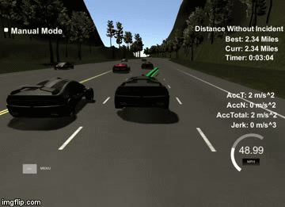

# Path-Planning
Path planning for self-driving car in a simulated highway scenario
## Self-Driving Car Engineer Nanodegree
***

A path planner is designed to create a smooth, safe path for the self-driving car to follow along a 3 lane highway with traffic. The path planner encompasses prediction, behaviour planning and trajectory generation. The results are demonstrated in a simulator, shown below. Localization and sensor fusion data are provided by the simulator. The path planner outputs a set of points that jointly form a trajectory. The simulated vehicle is designed to move to the next point in the list every 20 ms. The highway setting is more structured and straightforward than other driving scenarios such as urban driving but forms a good starting point.  

## Dependencies
***

*	cmake >= 3.5
*	make >= 4.1
*	gcc/g++ >= 5.4
*	uWebSockets
*	Udacity’s Simulator

## Evaluation
***

The vehicle successfully navigates the highway setting without incident. The vehicle was tested for X minutes, shown below. 

Some criteria that we looked for include:

*	Not exceeding speed limit
*	Not exceeding max acceleration and jerk rates
*	Avoiding any collisions
*	Remains in its lane except for lane changes
*	Changes lane when needed

The vehicle successfully met all criteria. 

## Background

1.	Perception
Localization data include vehicle state and map waypoints. The latter give global Cartesian coordinate positions as well as Frenet s and d values corresponding to distance along track and distance from center lane respectively. Sensor fusion data includes surrounding vehicle’s id and state. The combination of localization and sensor fusion data enables us to determine vehicle positions and determine future position of other vehicles at the end of the previous planned trajectory. 
2.	Behaviour planning
Behaviour planning involves determining the next manoeuvre to take. Given the distance to the vehicle in front and on either side, the path planner determines whether to slow down and remain in its lane, change lane left or change lane right. A minimum safe distance is specified to ensure safety. 
3.	Trajectory Generation
Trajectories are based on a series of coordinate points that has been combined using spline methods.  Based on the last two point of the previous trajectory, or the vehicles position if not trajectory has been made, and three more points further out (30, 60 and 90 metres), a smooth spline is generated. Points are generated based on which lane we want to be in and what speed is required. To ensure continuity from one trajectory to the next, the previous trajectory is combined with the spline function.
